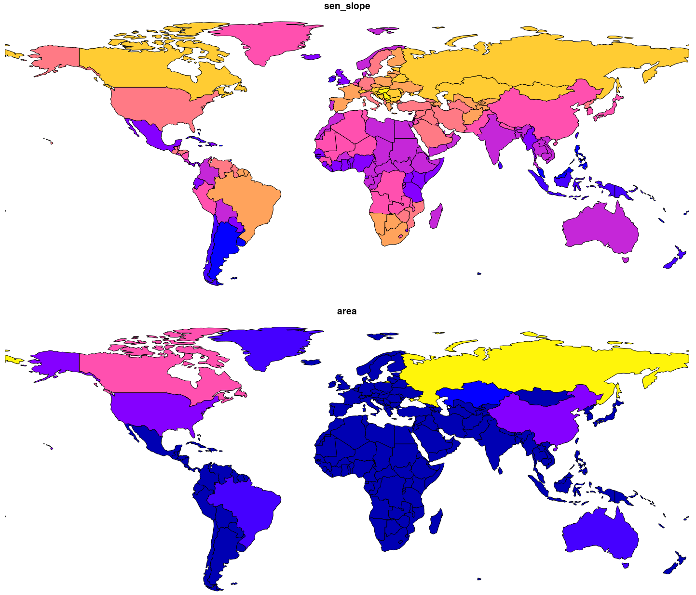
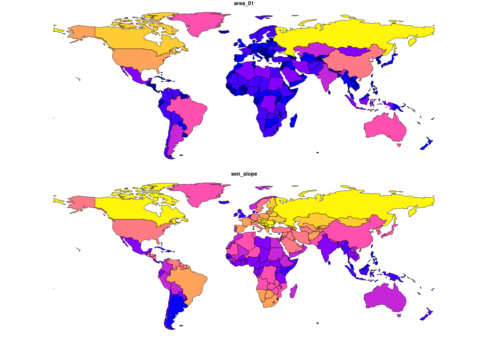

```{r setup, include=FALSE}
knitr::opts_chunk$set(echo = TRUE)
library(sf)
```

## Equation

```{r eval=FALSE}
for (j in  seq_len(nrow(centroids))) {
  distance <- distances[, j]
      
  # calculate force vector
  Fij <- mass[j] * radius[j] / distance
  Fbij <- mass[j] * (distance / radius[j]) ^ 2 * (4 - 3 * (distance / radius[j]))
  Fij[distance <= radius[j]] <- Fbij[distance <= radius[j]]
  Fij <- Fij * forceReductionFactor*100 / distance
      
  # calculate new border coordinates
  newpts_01 <- newpts + cbind(X1 = Fij, X2 = Fij) * (newpts - centroids[rep(j, nrow(newpts)), ])
}
plot(newpts)
points(newpts_01, col = "red")
```

<figure>
  <center>
  <br>
  <caption><strong>Sen Slope values (feature) and area in meters for the whole world.</strong></caption> 
  </center>
</figure>

## Iteration

<center>

</center>
